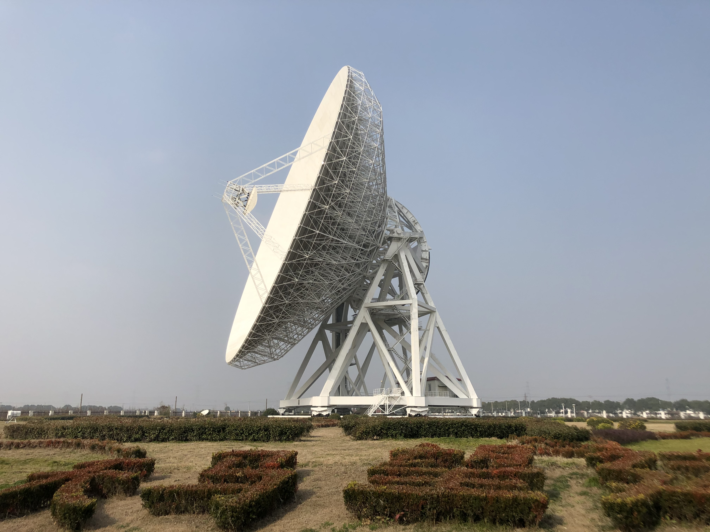
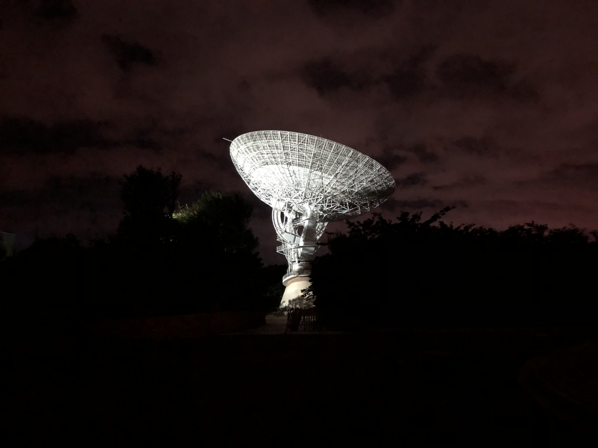
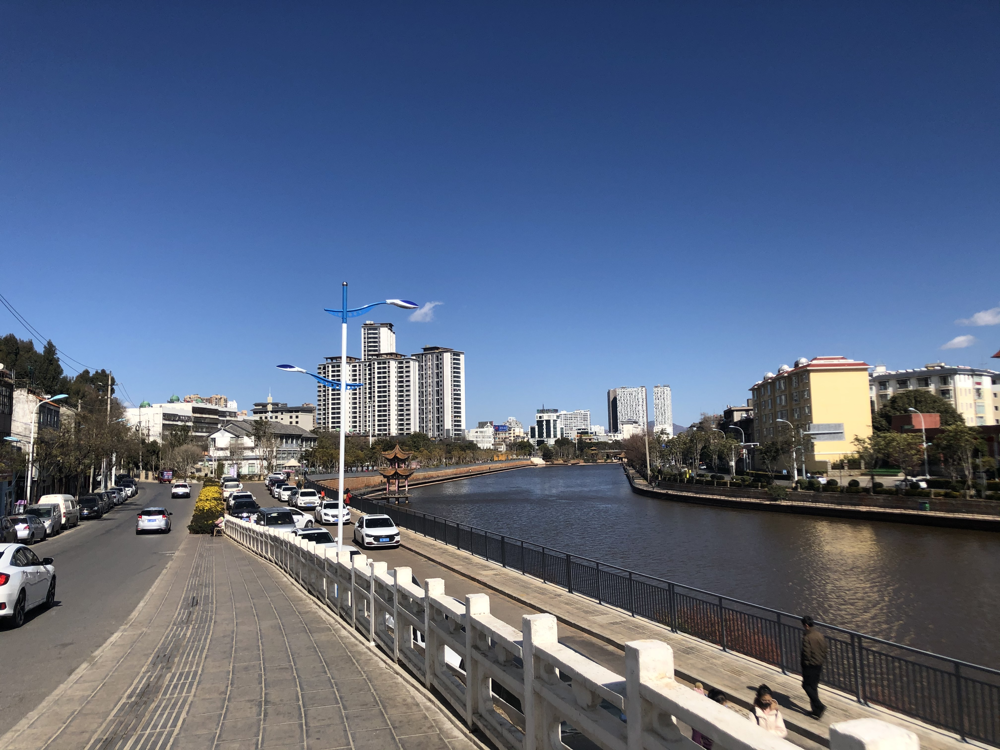
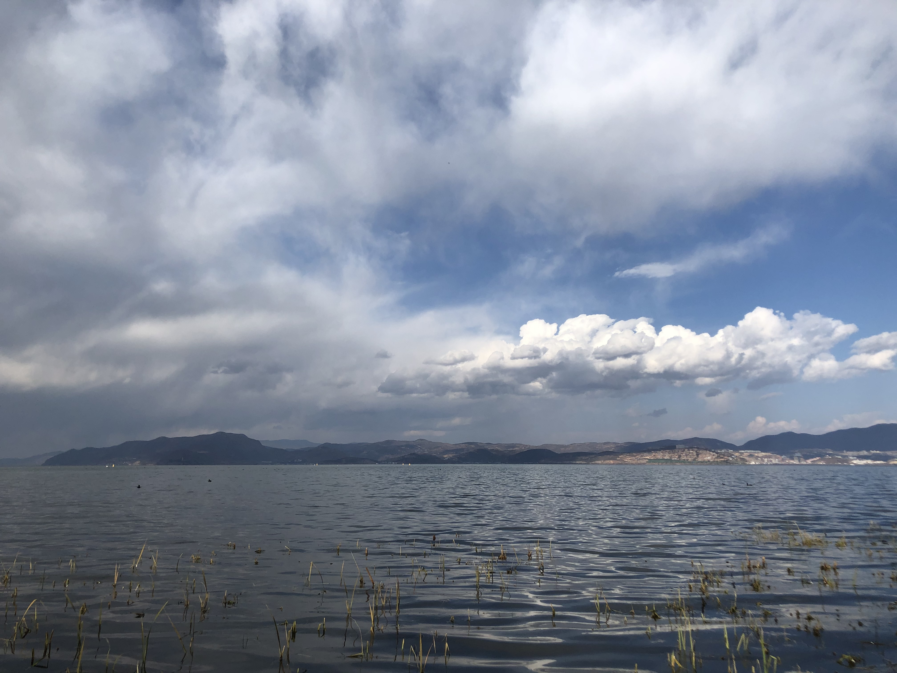

# Yang, Yanhui

E-Mail: se20160607@mail.ustc.edu.cn  
Curriculum Vitae [pdf version](/Curriculum_Vitae.pdf)

## Education
University of Science and Technology of China
Major: Astronomy/Astrophysics 
School: School of Physical Sciences  
 August 2017 - present 

## Research

### Interests

### Experiences
_Hydrodynamic simulations of turbulent mixing layers of galactic winds_
[California Institute of Technology](https://www.caltech.edu/)     Summer 2020\\
    Mentored by \href{http://www.tapir.caltech.edu/~suoqing/}{Suoqing Ji}, \href{http://www.tapir.caltech.edu/~phopkins/Site/About_Me.html}{Philip F. Hopkins}\\
    
    \noindent\emph{The formation of seed black holes}\\
    \href{http://english.ynao.cas.cn/}{\textbf{Yunnan Observatories, Chinese Academy of Sciences}} \hfs July 2019 - June 2020 \\
    Mentored by \href{http://users.ynao.ac.cn/~xbdong/}{Xiaobo Dong}, Runyu Meng

## Visits

## Skills

## Photographs

- Campus
    
 

- Visits and Travels
  
 

- Hometown
 

